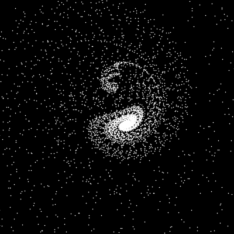
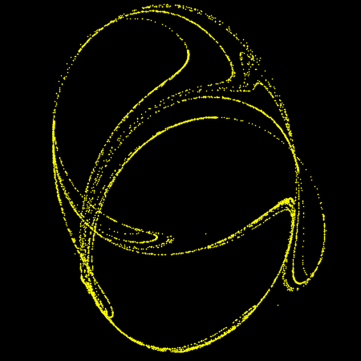
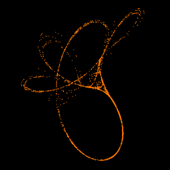
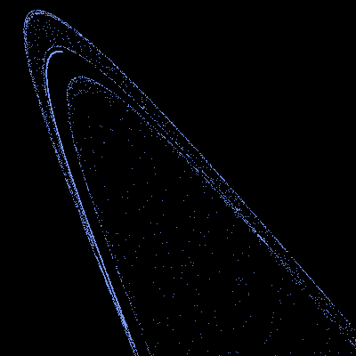

# chaotic-maps

The goal of this project is to provide simple implementations of [chaotic maps](https://en.wikipedia.org/wiki/List_of_chaotic_maps) in [Processing](http://processing.org).

-------------------------------------------------------------------------------------------------------------

| Image                                                       | Name           | Time Domain | Code        |
| :---                                                        | :---           |    :---:    |    :---:    |
|         | Duffing        | Discrete    |  [:information_source:](discrete/duffing/duffing.pde)       | 
|  | Gingerbreadman | Discrete    |  [:information_source:](discrete/gingerbreadman/gingerbreadman.pde) | 
|           | Hénon          | Discrete    |  [:information_source:](discrete/henon/henon.pde)           | 
|           | Ikeda          | Discrete    |  [:information_source:](discrete/ikeda/ikeda.pde)           | 
|    | Kaplan-Yorke   | Discrete    |  [:information_source:](discrete/kaplan_yorke/kaplan_yorke.pde) | 
|   | Peter de Jong  | Discrete    |  [:information_source:](discrete/peter_de_jong/peter_de_jong.pde) | 
|      | Tinkerbell     | Discrete    |  [:information_source:](discrete/tinkerbell/tinkerbell.pde) |
|      | Zaslavskii     | Discrete    |  [:information_source:](discrete/zaslavskii/zaslavskii.pde) |
|          | Chua           | Continuous  |  [:information_source:](continuous/chua/chua.pde)           |
|       | Duffing        | Continuous  |  [:information_source:](continuous/duffing/duffing.pde)     |
|        | Lorenz         | Continuous  |  [:information_source:](continuous/lorenz/lorenz.pde)       |
|       | Rössler        | Continuous  |  [:information_source:](continuous/rossler/rossler.pde)     |
|     | Van der Pol    | Continuous  |  [:information_source:](continuous/vanderpol/vanderpol.pde) |
